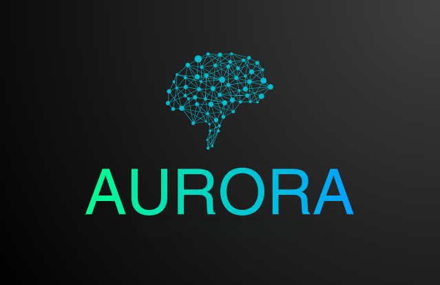

  

<h2 align="center">Welcome to the official AURORA project</h2>

  <em>Empowering learning through AI, Web3, and community-driven innovation.</em>

      <h2>What is AURORA.LA?</h2>
      
Our name represents our core values and mission:

      <h3>AURORA</h3>
      <ul>
        <li><strong>Adaptive</strong>: adjusts to student needs</li>
        <li><strong>Unlimited</strong>: boundless learning potential</li>
        <li><strong>Responsive</strong>: quick feedback</li>
        <li><strong>Organized</strong>: structured learning path</li>
        <li><strong>Resourceful</strong>: providing varied materials</li>
        <li><strong>Accessible</strong>: always available to help</li>
      </ul>
      <h3>LA (Learning Assistant)</h3>
      <ul>
        <li><strong>Language</strong>: Multi-language support and cultural understanding</li>
        <li><strong>Agent</strong>: AI-powered personal tutor and guide</li>
      </ul>
      
Together, <strong>AURORA</strong> embodies a revolutionary approach to language learning, combining the power of Stellar blockchain technology with intelligent, personalized education.

    </td>
  </tr>
</table>

## Introduction  
AURORA.LA is an innovative AI-powered language learning platform that combines personalized tutoring, blockchain technology, and advanced language processing to create an engaging and effective learning experience.

## Overview  
AURORA serves as your dedicated AI Agent for language learning, offering a comprehensive suite of features designed to accelerate your language acquisition journey. By leveraging cutting-edge AI technology and the Stellar blockchain, AURORA provides a unique, personalized, and rewarding learning experience.
# Language Learning Platform Features

## Core Features
- **Adaptive personalized tutoring** with CEFR certification (A1-C2)
- **Interactive conversation practice** with real-time feedback
- **Blockchain rewards system** on Stellar with daily challenges
- **AI-powered content generation** tailored to interests and industry
- **Advanced language tools** with contextual translations
- **Professional development** with interview prep and resume review

## Technology Stack
- **AI**: GPT content generation, Whisper speech processing, NLP
- **Blockchain**: Starknet smart contracts and token rewards
- **Learning Tools**: Error correction, progress tracking, analytics

## Additional Features
- **Accessibility options** for visual/auditory needs
- **Community features**: study rooms, mentorship, group challenges
- **Smart learning** with sentiment analysis and adaptive paths

## Roadmap
- **Enhanced AI personalization**
- **Expanded industry content**
- **Advanced blockchain features**
- **Extended platform support**

## The Team🛠️

<table align="center">
  <tr>
    <td align="center">
      
       
      <strong>Anwar Sanchez</strong>
    </td>
    <td align="center">
      
       
      <strong>Gerson Loaiza</strong>
    </td>
    <td align="center">
      
       
      <strong>Christopher </strong>
    </td>
     <td align="center">
      
       
      <strong>Josué Araya</strong>
    </td>
    <td align="center">
      
       
      <strong>Manuel Jiménez G</strong>
    </td>
  </tr>
</table>

## Connect With Us 🌍

Stay updated and engaged with our community through our social networks:

- **LinkedIn:** coming soon...
- **X (formerly Twitter):** coming soon...
- **Telegram:** [AURORA.LA Community](https://t.me/+kU23GZ7H1bhmY2Yx)

## 🤝 Contributing

We welcome contributions from developers, designers, educators, and anyone passionate about reshaping learning through technology.

If you’d like to get involved, feel free to reach out through our official channels.

Let’s unlock human potential through accessible and intelligent education. 🚀📚
